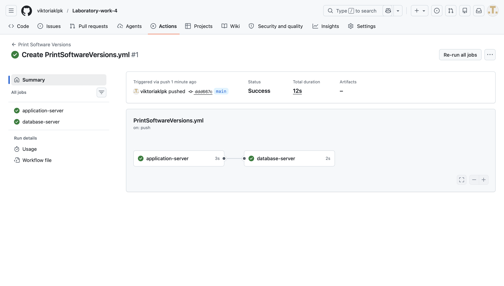
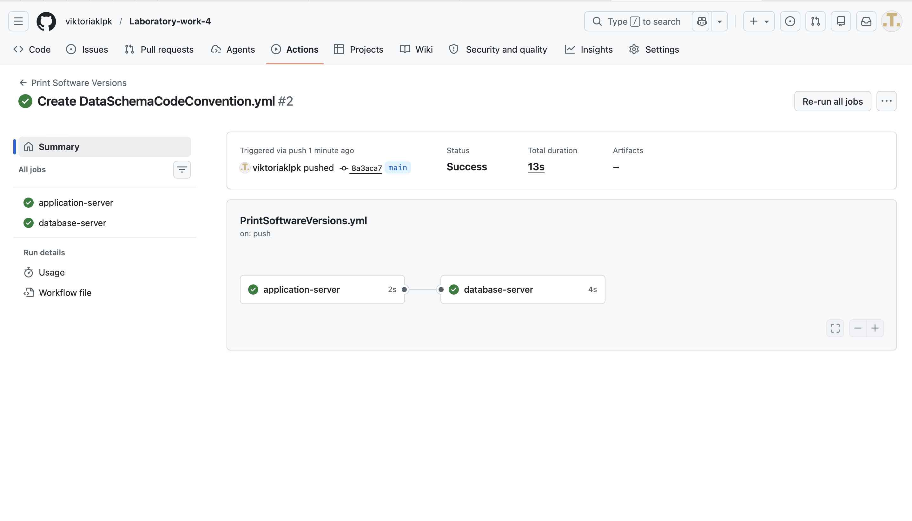

# Laboratory work 4

## Print Software Versions

Workflow for checking software versions in GitHub Actions.

## Result

---

## Data Schema Code Convention

Workflow for automated SQL code verification using SQLFluff.

## Result

